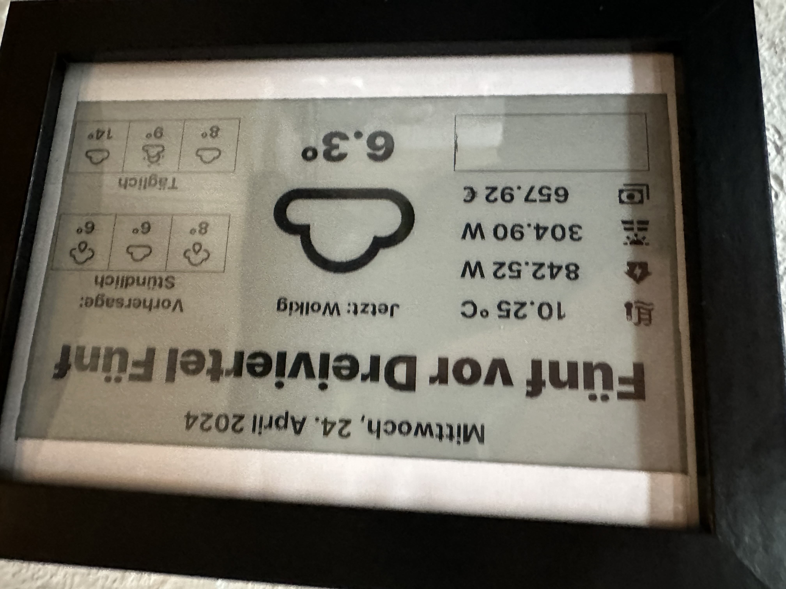

# ESPHome E-Ink Dashboard

[](https://github.com/ziermmar/esphome-epaper-dashboard/actions/workflows/ci.yml)
[](https://scorecard.dev/viewer/?uri=github.com/ziermmar/esphome-epaper-dashboard)



An ESPHome firmware for a Waveshare 7.5" e-ink display driven by an ESP32. It connects to Home Assistant via the native API and renders a daily-glanceable dashboard: current weather with translated state and MDI icons, indoor and outdoor temperatures, a German word clock, and other sensor data — all refreshing automatically whenever values change. The device fits inside an IKEA Ribba picture frame and draws minimal power thanks to the e-ink panel.

## Features

* ESPHome dashboard on Waveshare 7.5" E-Paper display
* Home Assistant sensor data (weather, temperature, time, and more)
* Material Design Icons
* Translated sensor output (German example included)
* Word clock (German)
* Fits in an IKEA Ribba picture frame

## Hardware

* [Waveshare 7.5 inch E-Ink Display with ESP32 driver board](https://amzn.to/3JBRzas) — 72 €
* [Logilink Flat USB Power supply](https://amzn.to/3JD4Gbe) — 8 €
* [4.5 m micro USB cable](https://amzn.to/44jEufC) — 9 €

*(Amazon.de affiliate links)*

## Flash prebuilt firmware

A prebuilt binary for the hardware listed above is published on every push to `main`. Flash it directly in your browser via the [ESPHome Web Installer](https://ziermmar.github.io/esphome-epaper-dashboard/) — no toolchain required.

You will still need to configure your WiFi credentials, API key, and Home Assistant entities (see [Setup](#setup) below).

## Setup

### 1. Install ESPHome

Follow the [ESPHome getting started guide](https://esphome.io/guides/getting_started_command_line.html).

### 2. Create `secrets.yaml`

Copy the template below and fill in your values:

```yaml
api_key: "your-api-key"
ota_password: "your-ota-password"
wifi_ssid: "your-ssid"
wifi_password: "your-wifi-password"
fallback_ssid: "Dashboard-Epaper"
fallback_password: "your-fallback-wifi-password"
```

### 3. Add Home Assistant template sensors

Merge the contents of `home_assistant/home-assistant-configuration.yaml` into your Home Assistant `configuration.yaml`, then restart Home Assistant.

### 4. Download the MDI font

The [Material Design Icons webfont](https://github.com/Templarian/MaterialDesign-Webfont/blob/master/fonts/materialdesignicons-webfont.ttf) must be downloaded manually and placed in the `fonts/` directory:

```shell
mkdir -p fonts
curl -L -o fonts/materialdesignicons-webfont.ttf \
  https://github.com/Templarian/MaterialDesign-Webfont/raw/master/fonts/materialdesignicons-webfont.ttf
```

> The Inter font is fetched automatically via `gfonts://` and does not need to be downloaded.

### 5. Flash your device

```shell
esphome run dashboard-epaper.yaml
```

## Project structure

```
dashboard-epaper.yaml        # Main ESPHome configuration
secrets.yaml                 # WiFi/API credentials (gitignored, create locally)
includes/
  display_lambda.cpp         # Display rendering entry point
  datetime.h                 # Date/time formatting helpers
  translate.h                # Weather state translations
  mdi_icon.h                 # MDI icon mappings
  wordclock.h                # German word clock logic
home_assistant/
  home-assistant-configuration.yaml   # Template sensors to add to HA
fonts/                       # Font files (gitignored, download manually)
```

## Acknowledgements

* [Material Design Icons](https://pictogrammers.com/library/mdi/) — icon lookup and Unicode code points
* [MaterialDesign-Webfont](https://github.com/Templarian/MaterialDesign-Webfont) — TTF font file
* Inspired by [esphome-weatherman-dashboard](https://github.com/Madelena/esphome-weatherman-dashboard)
* Inspired by [E-Paper-DashBoard](https://github.com/techdregs/E-Paper-DashBoard)
* Inspired by [ESPHome-ePaper-Calendar](https://github.com/paviro/ESPHome-ePaper-Calendar)
