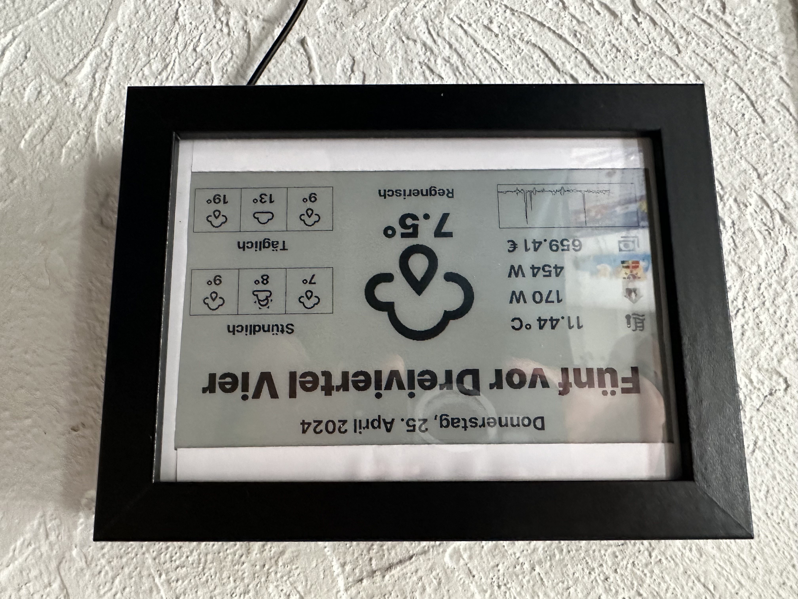

# ESPhome E-Ink Dashboard



## Features

* ESPHome Dashboard on Waveshare E-Paper
* Displays sensor outputs
* Material Design Icons
* Ability to translate sensor output (example in german)
* Wordclock (german)
* Fits in IKEA Ribba Picture Frame

## Instructions

1. Follow [ESPhome](https://esphome.io) documentation

2. Create secrets.yml and add your own values

    ```yaml
    api_key: "your-api-key"
    ota_password: "your-ota-password"
    wifi_ssid: "your-ssid"
    wifi_password: "your-wifi-password"
    fallback_ssid: "Dashboard-Epaper"
    fallback_password: "your-fallback-wifi-password"
    ```

3. Integrate contents of ```home-assistant-configuration.yaml``` into your Homeassistant ```configuration.yaml```

4. Download Material Design Fonts (links below)

    Copy fonts into ```fonts/``` directory

5. Upload dashboard-epaper.yaml to your ESP32

   ```shell
   esphome run dashboard-epaper.yaml
   ```

## Links and Acknowledgements

* Material Design Icons: <https://github.com/google/material-design-icons/tree/master/font>
* Material Design Icons: <https://github.com/Templarian/MaterialDesign-Webfont/blob/master/fonts/materialdesignicons-webfont.ttf>
* Lookup UTF IDs in MDI Font: <https://pictogrammers.com/library/mdi/>
* Inspired by this Project: <https://github.com/Madelena/esphome-weatherman-dashboard>
* Inspired by this Project: <https://github.com/techdregs/E-Paper-DashBoard>
